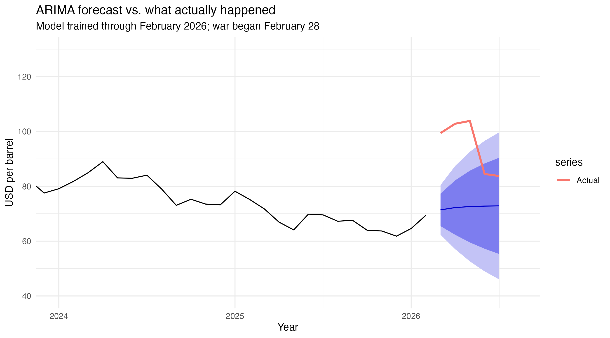

# Oil Price Volatility and Azerbaijan's Fiscal Exposure

Time series forecasting of Brent crude oil prices, and what forecast error means for an oil-dependent state.

## Summary

Can oil prices be forecast from their own history? Using 415 months of Brent crude
prices (1992–2026), I fit an ARIMA(2,1,1) model on data through February 2026 and
tested it against the following five months.

The model failed. Out-of-sample error was 22.97% (RMSE $24.29), roughly five times
worse than in-sample error, and actual prices fell outside the 95% prediction
interval for three consecutive months. The model also barely beat a naive
"next month equals this month" benchmark.

The cause was an armed conflict beginning 28 February 2026 that disrupted tanker
traffic through the Strait of Hormuz — an event no price history could anticipate.

Azerbaijan's oil rents have averaged 25.1% of GDP since 2000, higher than Russia
and nearly four times Norway's. A forecast error of this size maps onto roughly
5.8% of GDP, suggesting the policy response is stronger fiscal buffers rather than
better forecasting.

## Report

Full analysis: [oil_report.md](oil_report.md)

## Methods

- **Data**: Brent crude monthly prices (FRED, `POILBREUSDM`); oil rents as % of GDP (World Bank WDI)
- **Diagnostics**: classical decomposition, Augmented Dickey-Fuller tests, ACF/PACF
- **Modelling**: ARIMA with AICc model selection, out-of-sample validation against a naive benchmark
- **Visualization**: ggplot2

## Files

| File | Purpose |
|------|---------|
| `01_get_data.R` | Retrieve Brent prices from FRED, build time series, train/test split |
| `02_diagnostics.R` | Decomposition, stationarity testing, correlation structure |
| `03_models.R` | ARIMA fitting, forecasting, accuracy evaluation |
| `04_Azerbaijan.R` | Oil dependence comparison via World Bank data |
| `oil_report.Rmd` | Full write-up (source) |

## Reproducing

Run the scripts in numerical order. All data is retrieved via API — no data files needed.